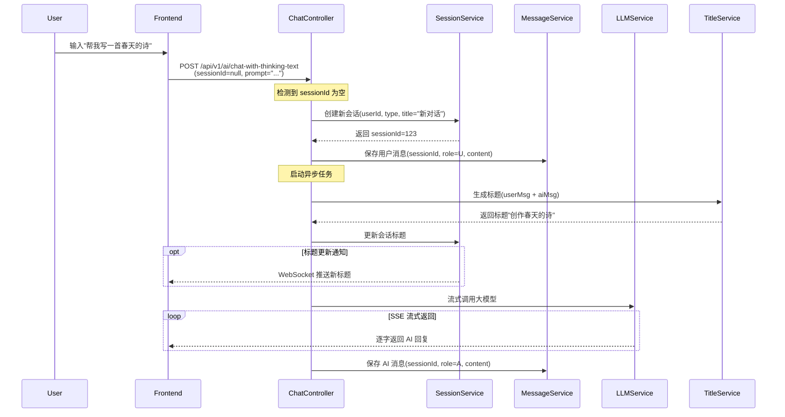
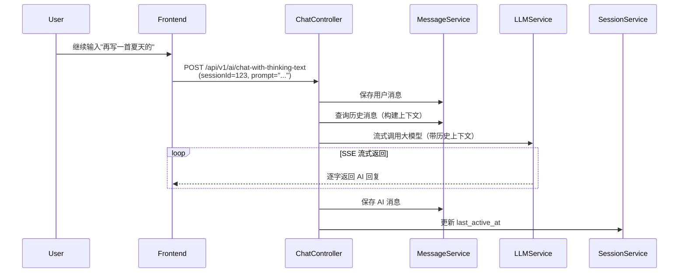

# 功能设计


* 身份认证
  * JWT无状态身份认证，单点登录
* 会话管理
  * 自动创建和维护用户对话历史
  * 使用用户ID实现用户间会话数据隔离
  * 会话分组管理（增删改查）
  * (前端消息滚动加载与缓存机制，优化浏览体验)
* AI对话
  * SSE 流式响应
  * 支持模型切换
  * 支持多模态AI聊天
  * 支持会话标题自动生成
  * (上下文窗口自动压缩/截断)
  * (敏感词过滤与违禁内容检测；AI回复内容安全审核)
  * (AI回复评价(点赞/踩))
* 多模态
  * 准备支持
    * 文字对话
    * 文生图
    * 图生图
    * 文生代码
  * 暂不支持
    * 文生视频
    * 文生音乐
    * <u>文生语音</u>
    * 图生视频
* 缓存的使用
  * 登录黑名单
  * 缓存AI模型列表(弱一致性需求，不设置过期时间)
  * **限流与配额**：（滑动窗口）计数器实现 API 调用频率限制、用户配额控制
* 文件上传
  * 安全校验机制，通过MIME类型验证和SHA256文件完整性校验
  * 异步 IndexingPipeline
* 搜索
  * 基于Elasticsearch构建支持全文检索、词条高亮及多字段聚合的独立搜索服务


#### 多模态设计

文生图：

* 当用户使用自然语言表达生图的语意时就触发(使用轻量模型分析)

* 生成的图片保存到oss

* 使用通义万象模型

* 回复格式示例

  ```
  User: 帮我画一只可爱的猫咪
  AI: 为您生成图片: 可爱的猫咪
        [generated image here]
  ```

  


# 需求排期


- [ ] 会话管理
  - [x] **自动创建和维护用户对话历史**
  - [x] **使用用户ID实现用户间会话数据隔离**
  - [x] 会话分组管理（增删改查）
  - [ ] ~~(前端消息滚动加载与缓存机制，优化浏览体验)~~
- [ ] AI对话
  - [x] SSE 流式响应
  - [x] **支持模型切换**
  - [ ] **支持多模态AI聊天**
- [ ] 文件上传
  - [x] 安全校验机制，通过MIME类型验证和SHA256文件完整性校验
  - [ ] **异步 IndexingPipeline**，将文档解析、Chunk生成、向量 Embedding 和 QA 对生成拆分为独立阶段，提升**大文档处理吞吐能力**
- [ ] 缓存的使用
  - [x] 登录黑名单
  - [ ] 缓存AI模型列表(弱一致性需求，不设置过期时间)
  - [ ] **限流与配额**：（滑动窗口）计数器实现 API 调用频率限制、用户配额控制
- [ ] 搜索
  - [ ] ~~基于Elasticsearch构建支持全文检索、词条高亮及多字段聚合的独立搜索服务~~


# 解决方案

### 文本对话与图片生成的区分

**Intent detection as a router** ：使用 `IntentDetectionService` 分析输入，路由到合适的handler

> 扩展性强，未来可以添加新的handler（code gen, video, etc.）

```
User Input → IntentDetectionService → Intent Router
                                           ↓
                        ┌──────────────────┴──────────────────┐
                        ↓                                      ↓
              TextChatService                        WanxImageService
              (existing)                              (new)
                        ↓                                      ↓
              SSE streaming                          Save to OSS
                        ↓                                      ↓
              Frontend text                         Frontend image
              rendering                              rendering

```

| Component                | File                                  | Responsibility                        |
| ------------------------ | ------------------------------------- | ------------------------------------- |
| `IntentDetectionService` | `service/IntentDetectionService.java` | AI-powered intent analysis            |
| `WanxImageService`       | `service/WanxImageService.java`       | Wanx FLUX API integration             |
| `ImageGenerationAdvisor` | `adviser/ImageGenerationAdvisor.java` | Prompt preprocessing for image reques |
| `ChatServiceImpl` | `service/impl/ChatServiceImpl.java` |                 |
| `ChatController`  | `controller/ChatController.java`    |            |
| `Attachment`      | `entity/Attachment.java`            |  |


### 标题生成

前端默认使用第一句话作为标题，流式返回结束之后生成标题


# 会话与消息流程设计


1. 如果 sessionId 为空，创建新会话并保存用户消息
   * 异步生成会话标题（仅首条消息），生成结束通过SSE通知前端
2. 如果 sessionId 存在，直接保存用户消息
3. 流式调用大模型获取回复
4. 流结束后保存 AI 消息


## 目录
- [核心原则](#核心原则)
- [数据模型](#数据模型)
- [业务流程](#业务流程)
- [接口设计](#接口设计)
- [前端交互指南](#前端交互指南)

---

## 核心原则

### 1. 会话与消息强绑定
- **会话 ≠ 空壳**：不允许存在没有消息的会话
- **会话由第一条消息触发创建**：用户发送第一条消息时才创建会话
- **CRUD 操作围绕"消息"展开**，会话是消息的聚合容器
- **前端不主动创建会话 ID**，由服务端在首条消息入库后返回

### 2. 标题生成策略
- **异步生成**：不阻塞主聊天流程
- **智能摘要**：基于首轮对话（用户问题 + AI回答）生成
- **初始标题**：创建时使用"新对话"占位，生成后更新

### 3. 流式响应处理
- **SSE（Server-Sent Events）**：用于 AI 回复的流式输出
- **消息持久化时机**：流式输出完成后统一保存
- **标题更新通知**：可通过 WebSocket 或轮询实现


## 业务流程

**流程 1：首条消息发送（创建会话）**



**流程 2：后续消息发送（已有会话）**




```typescript
{
  sessionId: number;
  title?: string;    // 更新标题
  groupId?: number;  // 更新分组
}
```

---

#### DELETE `/api/v1/ai/session`

**功能**：删除会话（软删除）

**请求参数**：
```typescript
{
  sessionId: number;
}
```


## 前端交互

### ❌ 不要这样做

```javascript
// ❌ 错误：点击"新建对话"时创建会话
async function createNewChat() {
    const response = await api.createSession({
        userId: currentUser.id,
        type: 'chat'
    });
    currentSessionId = response.data;
    router.push(`/chat/${currentSessionId}`);
}
```

### ✅ 应该这样做

```javascript
// ✅ 正确：仅在发送首条消息时创建会话
async function sendMessage(content) {
    const eventSource = new EventSource(
        `/api/v1/ai/chat-with-thinking-text?` +
        `prompt=${encodeURIComponent(content)}&` +
        `sessionId=${currentSessionId || ''}`
    );
    
    eventSource.onmessage = (event) => {
        // 处理流式数据
        appendToMessage(event.data);
    };
    
    eventSource.addEventListener('session-created', (event) => {
        // 首条消息时，后端会推送新会话ID
        const data = JSON.parse(event.data);
        currentSessionId = data.sessionId;
        router.push(`/chat/${data.sessionId}`);
    });
}

// 点击"新建对话"只需清空本地状态
function createNewChat() {
    currentSessionId = null;
    messages = [];
    router.push('/chat');  // 不带 sessionId
}
```

---

## 技术选型建议

### SSE vs WebSocket

| 场景 | 推荐技术 | 说明 |
|------|---------|------|
| AI 回复流式输出 | ✅ SSE | 简单、基于HTTP、天然支持文本流 |
| 会话标题更新通知 | SSE 或轮询 | 轻量级场景，SSE足够 |
| 多端实时同步 | ✅ WebSocket | 需要双向通信时使用 |

### 标题生成时机

- **触发时机**：AI 回复完成后立即触发（异步）
- **生成方式**：
  1. 调用小模型（如 qwen-flash）生成摘要
  2. 提示词：`根据以下对话生成一个简短标题（不超过20字）：\n用户：{user_msg}\nAI：{ai_msg}`
- **失败处理**：保留"新对话"标题，可手动重试

---

## 实现要点

### 1. 事务处理

```java
@Transactional
public Long createSessionWithFirstMessage(Long userId, String type, String content) {
    // 1. 创建会话
    ChatSession session = ChatSession.builder()
        .userId(userId)
        .type(type)
        .title("新对话")
        .status(true)
        .lastActiveAt(LocalDateTime.now())
        .build();
    sessionMapper.insert(session);
    
    // 2. 保存用户消息
    ChatMessage message = ChatMessage.builder()
        .sessionId(session.getId())
        .role("U")
        .content(content)
        .status(true)
        .build();
    messageMapper.insert(message);
    
    return session.getId();
}
```

### 2. 异步标题生成

```java
@Async
public void generateAndUpdateTitle(Long sessionId) {
    try {
        // 获取首轮对话
        List<ChatMessage> messages = messageService.getFirstRound(sessionId);
        
        // 调用大模型生成标题
        String title = titleGenerationService.generate(messages);
        
        // 更新会话标题
        sessionService.updateTitle(sessionId, title);
        
        // 可选：通过 WebSocket 通知前端
        webSocketService.notifyTitleUpdate(sessionId, title);
    } catch (Exception e) {
        log.error("标题生成失败: sessionId={}", sessionId, e);
    }
}
```

### 3. 流式响应处理

```java
@PostMapping(value = "/chat-with-thinking-text", produces = "text/html;charset=utf-8")
public Flux<String> chat(
        @RequestParam String prompt,
        @RequestParam(required = false) Long sessionId) {
    
    // 如果没有 sessionId，创建新会话
    if (sessionId == null) {
        sessionId = createSessionWithFirstMessage(userId, "chat", prompt);
        // 通过响应头返回新会话ID
        // response.setHeader("X-Session-Id", sessionId.toString());
    } else {
        // 保存用户消息
        messageService.saveUserMessage(sessionId, prompt);
    }
    
    final Long finalSessionId = sessionId;
    StringBuilder aiResponse = new StringBuilder();
    
    // 流式调用大模型
    return llmService.streamChat(prompt, sessionId)
        .doOnNext(chunk -> aiResponse.append(chunk))
        .doOnComplete(() -> {
            // 流结束后保存 AI 消息
            messageService.saveAiMessage(finalSessionId, aiResponse.toString());
            // 异步生成标题
            asyncService.generateAndUpdateTitle(finalSessionId);
        });
}
```


